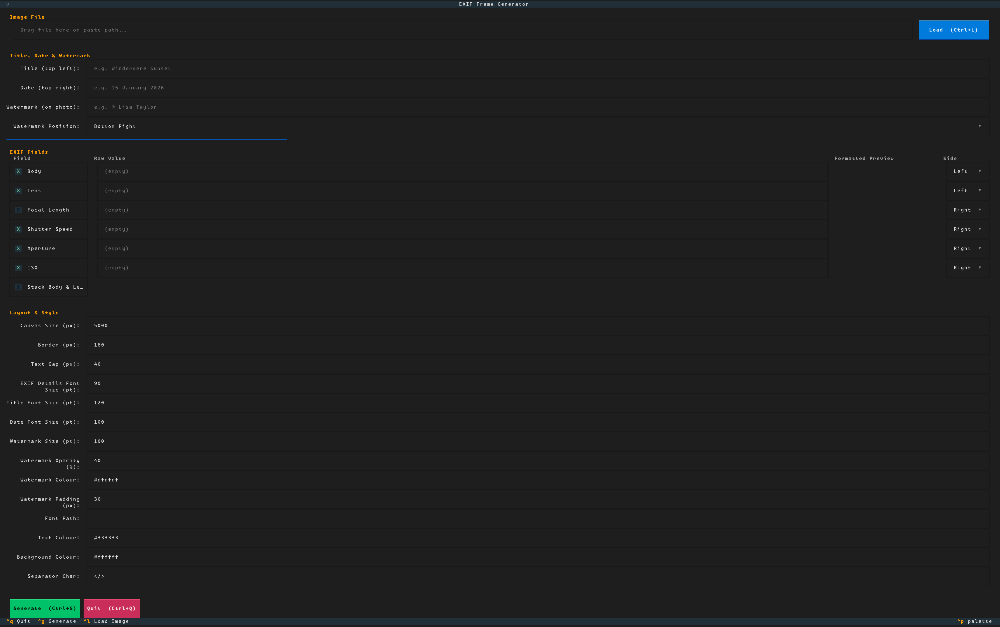

# EXIF Frame

A terminal UI for generating Instagram-style EXIF borders on your photos. Reads camera metadata automatically, lets you tweak everything, and outputs a print-ready framed image — all without leaving the terminal.




## What it does

You point it at a photo. It reads the EXIF data (camera body, lens, shutter speed, aperture, ISO, date) and builds a clean framed image with that metadata arranged around the photo on a configurable canvas. Think of those Instagram posts where photographers show their settings — but automated and customisable.

The TUI lets you:

- Toggle which EXIF fields to include and place them left or right
- Add a title, date, and watermark with per-element font sizing
- Adjust canvas size, border, colours, fonts, separator characters
- Stack body and lens info vertically or keep them inline
- Preview formatted values live as you edit
- Output to a `framed/` subfolder next to the original

## Prerequisites
### ExifTool

- **macOS:** `brew install exiftool`
- **Ubuntu/Debian:** `sudo apt install libimage-exiftool-perl`
- **Arch:** `sudo pacman -S perl-image-exiftool`
- **Windows:** Download from https://exiftool.org
### ImageMagick (v7+)

- **macOS:** `brew install imagemagick`
- **Ubuntu/Debian:** `sudo apt install imagemagick`
- **Arch:** `sudo pacman -S imagemagick`
- **Windows:** Download from https://imagemagick.org/script/download.php

> **Note:** This tool uses the `magick` command (ImageMagick v7). If your system only has `convert` (v6), you'll need to upgrade or alias it.

## Install

```bash
git clone https://github.com/BritishFr0g/exif-frame.git
cd exif-frame
pip install -r requirements.txt
```

## Usage

```bash
# Launch with an image
python exif_frame.py ~/Photos/DSC00123.ARW

# Or launch empty and load a file from the TUI
python exif_frame.py
```

### Keyboard shortcuts

| Key | Action |
|---|---|
| `Ctrl+L` | Load a new image |
| `Ctrl+G` | Generate the framed output |
| `Ctrl+Q` | Quit |

The output is saved to a `framed/` directory alongside the source image.

## Customisation

Everything is adjustable in the TUI, but the defaults are sensible for a 5000×5000 px square canvas (good for Instagram). You can change:

- **Canvas size** — output resolution in pixels
- **Border** — padding around the photo
- **Font** — supply any `.ttf` or `.otf` path
- **Colours** — hex codes for text, background, and watermark
- **Separator** — the character between EXIF fields (default `</>`)
- **Watermark** — text burned onto the photo itself, with adjustable opacity and position

## How it works

1. `exiftool` reads the camera metadata from the image file
2. The TUI presents the values for review and editing
3. On generate, `magick` resizes the photo to fit the canvas, composites it onto a coloured background, and annotates the EXIF text and any watermark
4. The result is saved as a high-quality JPEG

No Python image libraries are used for the compositing — it's all delegated to ImageMagick, so it handles RAW files, large images, and unusual colour spaces well.

## License

MIT — see [LICENSE](LICENSE).
